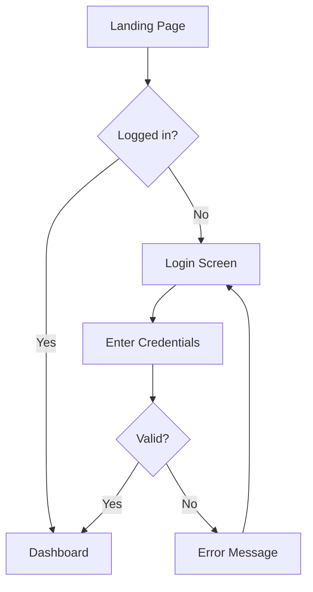

# Wireframe Prompt

Use this prompt to create wireframes and UI flows following Avanade Method standards.

## Quick Start

```
Create a wireframe for [screen/flow name]:

**Screen Purpose**: [What does this screen do?]

**Key Elements**:
- [Element 1]: [Description and interaction]
- [Element 2]: [Description and interaction]
- [Element 3]: [Description and interaction]

**User Flow**:
1. User [action] → [result]
2. User [action] → [result]
3. User [action] → [result]

**States**:
- Default: [Initial state]
- Loading: [During data fetch]
- Success: [After successful action]
- Error: [On failure]
```

## Wireframe Levels

### Low-Fidelity (Sketches)

- Boxes and placeholders
- Focus on layout and structure
- Grayscale only
- Fast iteration

### Mid-Fidelity (Structure)

- Real content
- Proper spacing
- Navigation defined
- Grayscale

### High-Fidelity (Visual Design)

- Brand colors and typography
- Imagery and icons
- Pixel-perfect
- Interactive prototype

## Standard Components

**Layout**:

- Header (logo, nav, user menu)
- Main content area
- Sidebar (if applicable)
- Footer

**Navigation**:

- Primary nav (top/side)
- Breadcrumbs
- Tabs/Pivots
- Back/Cancel actions

**Forms**:

- Input fields with labels
- Validation messages
- Submit/Cancel buttons
- Help text

**Feedback**:

- Loading indicators
- Success/Error messages
- Empty states
- Error states

## Fluent UI Components

```
Common Components:
- TextField
- Dropdown
- Checkbox
- Button (Primary, Secondary)
- Dialog/Modal
- MessageBar
- ProgressIndicator
- DataTable
```

## Accessibility Requirements

✅ Keyboard navigation support
✅ Screen reader labels (ARIA)
✅ Color contrast ≥4.5:1
✅ Focus indicators visible
✅ Error messages descriptive

## Mermaid User Flow Example



## Validation Checklist

✅ Responsive design (mobile/tablet/desktop)?
✅ Fluent Design guidelines followed?
✅ WCAG AA compliance?
✅ All user flows documented?
✅ Error states designed?

---

**Reference**: `${AVANADE_WIREFRAME_TEMPLATE}`
**Owner**: Sofia UX
**Agent**: Use `@sofia-ux` for assisted wireframe creation
