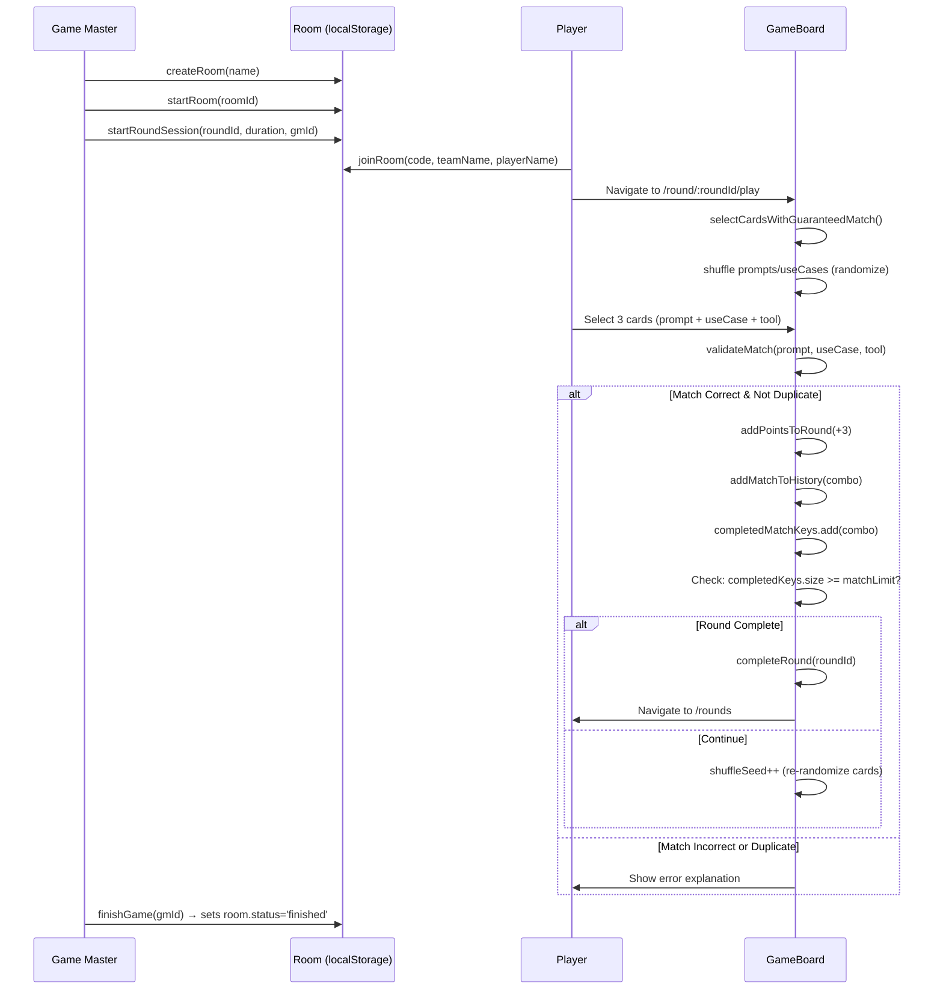

# Copilot Combate Game - Arquitetura Técnica

**Versão:** 2.0  
**Data:** 1 de junho de 2026  
**Stack Implementada:** React + Vite + localStorage / Azure Functions + Table Storage  
**Modelo:** SPA + Serverless (Azure)

---

## ⚠️ Nota sobre Versão

> A v1.0 deste documento (março 2026) descrevia uma arquitetura Firebase + Vercel que **não foi implementada**. A seção abaixo documenta a arquitetura **real em produção**. O conteúdo original da v1.0 permanece abaixo para referência histórica.

---

## Arquitetura Implementada (v2.0)

### Stack Tecnológico Real

```
┌─────────────────────────────────────────────────────────────┐
│                      COPILOT COMBATE GAME                   │
└─────────────────────────────────────────────────────────────┘

┌──────────────────┐       ┌──────────────────┐       ┌──────────────────┐
│    FRONTEND      │       │    BACKEND       │       │    STORAGE       │
│ (Azure Static    │◄─────►│ (Azure Functions)│◄─────►│ (Azure Table     │
│  Web Apps)       │       │                  │       │  Storage)        │
└──────────────────┘       └──────────────────┘       └──────────────────┘
  React 18 + TS              Node.js                    NoSQL Key-Value
  Vite                       HTTP Triggers               Partitioned
  Tailwind CSS               CORS Enabled                Tables
  localStorage               REST API
```

### Decisões Arquiteturais Reais

| Decisão | Tecnologia | Justificativa |
|---------|-----------|---------------|
| **Frontend** | React 18 + TypeScript + Vite | Component reusability, type safety, fast builds |
| **Styling** | Tailwind CSS (dark theme custom) | Rapid UI, consistent design tokens |
| **Icons** | lucide-react | Lightweight, tree-shakeable icon library |
| **Routing** | react-router-dom v6 | Client-side routing for SPA |
| **State Management** | localStorage + React state | Offline-first, no external state library needed |
| **Backend** | Azure Functions (Node.js) | Serverless, pay-per-use, Azure ecosystem |
| **Database** | Azure Table Storage | Low cost, simple key-value, sufficient for game state |
| **Hosting** | Azure Static Web Apps | Integrated with Azure Functions, global CDN |
| **Auth** | PIN + GM ID (simplified) | No Firebase needed for workshop context |

### Dual Storage Mode

O frontend opera em **dois modos** controlados pela variável `VITE_API_URL`:

```typescript
// apiClient.ts
const API_BASE_URL = import.meta.env.VITE_API_URL || '';
const USE_API = API_BASE_URL !== '';
```

| Modo | Quando | Armazenamento |
|------|--------|---------------|
| **Local** | `VITE_API_URL` não definido | localStorage (funciona 100% offline) |
| **Azure** | `VITE_API_URL` definido | Azure Table Storage via Azure Functions API |

### Estrutura Real do Projeto

```
copilot-combate-game/
├── packages/
│   ├── frontend/                    # React SPA
│   │   ├── src/
│   │   │   ├── components/
│   │   │   │   ├── admin/           # AdminDashboard, RoomManagement, etc.
│   │   │   │   ├── game/            # GameBoard, PlayingCard, MatchResult
│   │   │   │   ├── rounds/          # RoundSelection, RoundCard
│   │   │   │   ├── rooms/           # RoomJoin, Lobby
│   │   │   │   └── layout/          # Header, ProtectedRoute
│   │   │   ├── data/
│   │   │   │   └── mockData.ts      # Rounds, villains, cards, match rules
│   │   │   ├── types/
│   │   │   │   └── index.ts         # All TypeScript interfaces
│   │   │   ├── utils/
│   │   │   │   ├── apiClient.ts         # Dual-mode API (localStorage/Azure)
│   │   │   │   ├── cardManager.ts       # Card CRUD + match rule management
│   │   │   │   ├── roomManager.ts       # Room CRUD + team management
│   │   │   │   ├── sessionManager.ts    # Round timer sessions (GM-scoped)
│   │   │   │   ├── gameStateManager.ts  # Game finished state (room-scoped)
│   │   │   │   ├── teamsManager.ts      # Team scores + round completion
│   │   │   │   ├── roundProgressManager.ts  # Progress tracking per team
│   │   │   │   └── matchHistoryManager.ts   # Match dedup + history
│   │   │   ├── App.tsx              # Routes definition
│   │   │   └── main.tsx             # Entry point
│   │   ├── public/                  # Static assets (villain images, etc.)
│   │   ├── vite.config.ts
│   │   ├── tailwind.config.js
│   │   └── package.json
│   │
│   └── backend-azure/               # Azure Functions (Node.js)
│       ├── CreateMatch/              # POST match data
│       ├── CreateRoom/               # POST room creation
│       ├── CreateSession/            # POST round session
│       ├── GetGameState/             # GET game state
│       ├── GetMatches/               # GET matches
│       ├── GetRooms/                 # GET rooms
│       ├── GetSessions/              # GET sessions
│       ├── GetTeams/                 # GET teams
│       ├── UpdateGameState/          # PUT game state
│       ├── UpdateMatch/              # PUT match update
│       ├── UpdateRoom/               # PUT room update
│       ├── UpdateSession/            # PUT session update
│       ├── utils/
│       │   └── storage.js           # Azure Table Storage helpers
│       ├── host.json
│       ├── local.settings.json
│       └── package.json
├── docs/                            # Documentation
└── package.json                     # Workspace root
```

### Rotas da Aplicação

```
/                          → Home / Welcome
/join                      → Player joins room by code
/join/:roomCode            → Direct join link
/rooms/:roomId/lobby       → Room lobby (team selection)
/rounds                    → Round selection (4 rounds)
/round/:roundId/play       → Game board (card matching)
/gamemaster                → GM login
/gamemaster/dashboard      → GM dashboard (rooms, sessions, timer)
/admin/login               → Admin login (PIN)
/admin                     → Admin dashboard (cards, rules, rooms)
/debug                     → Debug dashboard (API health checks)
```

### localStorage Keys

| Key | Conteúdo |
|-----|----------|
| `copilot-combate-rooms` | Array de Room objects |
| `copilot-combate-current-room` | Room ID do jogador atual |
| `copilot-combate-current-player` | `{ roomId, teamId, playerName }` |
| `copilot-combate-sessions` | Array de RoundSession objects |
| `copilot-combate-teams` | Array de Team objects |
| `copilot-combate-round-progress-{teamId}` | Progress data per team |
| `copilot-combate-match-history` | Array de match records |
| `copilot-combate-custom-cards` | Custom cards added by admin |
| `copilot-combate-custom-rules` | Custom match rules added by admin |

### Fluxo de Dados Principal



### Build & Deploy

```bash
# Development
cd packages/frontend
npm run dev                    # Vite dev server on :5173

# Production Build
npm run build                  # Outputs to dist/
# Bundle: ~349KB JS (90KB gzipped) + 35KB CSS (7KB gzipped)

# Azure Deployment
# Frontend: Azure Static Web Apps (auto-deploys from GitHub)
# Backend: Azure Function App (auto-deploys from GitHub)
# Set VITE_API_URL env var in Static Web Apps config
```

---

## Arquitetura Original v1.0 (Referência Histórica)

> O conteúdo abaixo é da versão 1.0 do documento (março 2026) e descreve a arquitetura Firebase/Vercel que **não foi implementada**. Mantido para referência.

```
┌─────────────────────────────────────────────────────────────┐
│                      COPILOT COMBATE GAME                   │
└─────────────────────────────────────────────────────────────┘

┌──────────────┐         ┌──────────────┐         ┌──────────────┐
│   FRONTEND   │         │   BACKEND    │         │   STORAGE    │
│   (Vercel)   │◄───────►│  (Firebase)  │◄───────►│  (Firestore) │
└──────────────┘         └──────────────┘         └──────────────┘
   React 18                Cloud Functions          NoSQL Database
   TypeScript              Node.js 18               Real-time
   Tailwind CSS            Authentication           Collections
   Vite                    Storage                  Security Rules
```

### Decisões Arquiteturais Chave

| Decisão | Tecnologia | Justificativa |
|---------|-----------|---------------|
| **Frontend Framework** | React 18 + TypeScript | Component reusability, type safety, large ecosystem |
| **Build Tool** | Vite | Fast development, optimized production builds |
| **Styling** | Tailwind CSS | Rapid UI development, consistency, small bundle |
| **State Management** | React Context + useReducer | Sufficient for app complexity, no external deps needed |
| **Backend** | Firebase (Serverless) | Fully managed, auto-scaling, real-time capabilities |
| **Database** | Firestore | Real-time listeners, flexible schema, scales automatically |
| **Authentication** | Firebase Auth | Built-in security, custom claims for RBAC |
| **Hosting Frontend** | Vercel | Edge network, automatic CI/CD, preview deploys |
| **Functions Hosting** | Firebase Cloud Functions | Integrated with Firestore, easy triggers |
| **File Storage** | Firebase Storage | For villain avatars, future card images |

### Arquitetura Serverless

```
┌─────────────────────────────────────────────────────────────────────┐
│                         CLIENT DEVICES                              │
│  Mobile (iOS/Android) │ Tablet (iPad) │ Desktop (Chrome/Edge/Safari)│
└────────────────────────────┬────────────────────────────────────────┘
                             │ HTTPS
                             ▼
┌─────────────────────────────────────────────────────────────────────┐
│                    VERCEL EDGE NETWORK (CDN)                        │
│  ┌─────────────────────────────────────────────────────────────┐   │
│  │            React SPA (Static Assets + SSR)                  │   │
│  │  - index.html, bundle.js, styles.css                        │   │
│  │  - Code splitting, lazy loading                             │   │
│  └─────────────────────────────────────────────────────────────┘   │
└────────────────────────────────┬────────────────────────────────────┘
                                 │ Firebase SDK
                                 ▼
┌─────────────────────────────────────────────────────────────────────┐
│                      FIREBASE SERVICES                              │
│  ┌──────────────────┐  ┌──────────────────┐  ┌─────────────────┐  │
│  │  Authentication  │  │   Cloud Firestore │  │ Cloud Functions │  │
│  │  - Email/Password│  │   - users         │  │ - onMatchCreate │  │
│  │  - Google OAuth  │  │   - teams         │  │ - validateTest  │  │
│  │  - Custom Claims │  │   - rounds        │  │ - setUserRole   │  │
│  │  - Session Mgmt  │  │   - villains      │  │ - onUserCreate  │  │
│  └──────────────────┘  │   - cards         │  └─────────────────┘  │
│                        │   - matchRules    │                        │
│  ┌──────────────────┐  │   - matches       │  ┌─────────────────┐  │
│  │  Firebase        │  │   - testSubs      │  │  Firebase       │  │
│  │  Storage         │  │   - adminLogs     │  │  Analytics      │  │
│  │  - Villain imgs  │  └──────────────────┘  │  - User events  │  │
│  └──────────────────┘                        └─────────────────┘  │
└─────────────────────────────────────────────────────────────────────┘
```

---

## Estrutura do Projeto

### Monorepo Layout

```
copilot-combate-game/
├── packages/
│   ├── frontend/                 # React Application (Vercel)
│   │   ├── public/
│   │   │   ├── villain-avatars/  # Static villain images
│   │   │   └── manifest.json     # PWA manifest
│   │   ├── src/
│   │   │   ├── components/
│   │   │   │   ├── common/       # Shared UI components
│   │   │   │   │   ├── Header.tsx
│   │   │   │   │   ├── Footer.tsx
│   │   │   │   │   ├── Button.tsx
│   │   │   │   │   ├── Modal.tsx
│   │   │   │   │   ├── Card.tsx
│   │   │   │   │   └── Toast.tsx
│   │   │   │   ├── auth/         # Authentication components
│   │   │   │   │   ├── LoginForm.tsx
│   │   │   │   │   ├── RegisterForm.tsx
│   │   │   │   │   └── ProtectedRoute.tsx
│   │   │   │   ├── rounds/       # Round-related components
│   │   │   │   │   ├── RoundSelection.tsx
│   │   │   │   │   ├── RoundCard.tsx
│   │   │   │   │   ├── VillainIntro.tsx
│   │   │   │   │   └── RoundProgress.tsx
│   │   │   │   ├── game/         # Game board components
│   │   │   │   │   ├── GameBoard.tsx
│   │   │   │   │   ├── CardGrid.tsx
│   │   │   │   │   ├── PlayingCard.tsx
│   │   │   │   │   ├── MatchValidation.tsx
│   │   │   │   │   └── ScoreDisplay.tsx
│   │   │   │   ├── leaderboard/  # Leaderboard components
│   │   │   │   │   ├── Leaderboard.tsx
│   │   │   │   │   ├── IndividualList.tsx
│   │   │   │   │   └── TeamList.tsx
│   │   │   │   ├── admin/        # Admin panel components
│   │   │   │   │   ├── AdminDashboard.tsx
│   │   │   │   │   ├── CardManager.tsx
│   │   │   │   │   ├── RoundManager.tsx
│   │   │   │   │   ├── MatchRuleBuilder.tsx
│   │   │   │   │   ├── ValidationQueue.tsx
│   │   │   │   │   └── SessionMonitor.tsx
│   │   │   │   └── team/         # Team management
│   │   │   │       ├── TeamSelection.tsx
│   │   │   │       ├── CreateTeam.tsx
│   │   │   │       └── JoinTeam.tsx
│   │   │   ├── contexts/
│   │   │   │   ├── AuthContext.tsx      # User authentication state
│   │   │   │   ├── GameContext.tsx      # Game state (round, cards)
│   │   │   │   └── NotificationContext.tsx
│   │   │   ├── hooks/
│   │   │   │   ├── useAuth.ts           # Auth helper hook
│   │   │   │   ├── useFirestore.ts      # Firestore operations
│   │   │   │   ├── useRealtime.ts       # Real-time listeners
│   │   │   │   └── useAdmin.ts          # Admin operations
│   │   │   ├── services/
│   │   │   │   ├── firebase.ts          # Firebase initialization
│   │   │   │   ├── auth.service.ts      # Authentication logic
│   │   │   │   ├── rounds.service.ts    # Round operations
│   │   │   │   ├── cards.service.ts     # Card CRUD
│   │   │   │   ├── matches.service.ts   # Match validation
│   │   │   │   └── admin.service.ts     # Admin operations
│   │   │   ├── utils/
│   │   │   │   ├── validators.ts        # Input validation
│   │   │   │   ├── formatters.ts        # Data formatting
│   │   │   │   └── constants.ts         # App constants
│   │   │   ├── types/
│   │   │   │   └── index.ts             # TypeScript interfaces
│   │   │   ├── App.tsx
│   │   │   ├── main.tsx
│   │   │   └── index.css
│   │   ├── package.json
│   │   ├── vite.config.ts
│   │   ├── tailwind.config.js
│   │   └── tsconfig.json
│   │
│   ├── functions/                # Firebase Cloud Functions
│   │   ├── src/
│   │   │   ├── index.ts          # Function exports
│   │   │   ├── auth/
│   │   │   │   ├── onUserCreate.ts     # Auto-create user doc
│   │   │   │   └── setUserRole.ts      # Admin role management
│   │   │   ├── matches/
│   │   │   │   ├── onMatchCreate.ts    # Match logging
│   │   │   │   └── validateMatch.ts    # Server-side validation
│   │   │   ├── tests/
│   │   │   │   ├── approveTest.ts      # Approve submission
│   │   │   │   └── rejectTest.ts       # Reject submission
│   │   │   ├── admin/
│   │   │   │   ├── bulkImportCards.ts  # Bulk card import
│   │   │   │   └── logAdminAction.ts   # Audit logging
│   │   │   └── utils/
│   │   │       ├── firestore.ts        # Firestore helpers
│   │   │       └── validation.ts       # Validation helpers
│   │   ├── package.json
│   │   └── tsconfig.json
│   │
│   └── shared/                   # Shared TypeScript types
│       ├── src/
│       │   ├── types/
│       │   │   ├── user.ts       # User, UserRole
│       │   │   ├── team.ts       # Team
│       │   │   ├── round.ts      # Round, Villain
│       │   │   ├── card.ts       # Card, CardType
│       │   │   ├── match.ts      # Match, MatchRule
│       │   │   └── test.ts       # TestSubmission
│       │   └── index.ts
│       ├── package.json
│       └── tsconfig.json
│
├── docs/
│   ├── brief.md
│   ├── prd.md
│   └── architecture.md           # Este arquivo
│
├── firebase.json                 # Firebase configuration
├── firestore.rules               # Firestore security rules
├── firestore.indexes.json        # Firestore indexes
├── storage.rules                 # Storage security rules
├── .firebaserc                   # Firebase project aliases
├── package.json                  # Root package.json (workspace)
├── turbo.json                    # Turborepo config (opcional)
└── README.md
```

---

## Frontend Architecture

### React Component Architecture

```
┌─────────────────────────────────────────────────────────────┐
│                         App.tsx                             │
│  ┌────────────────────────────────────────────────────┐    │
│  │           AuthProvider (AuthContext)                │    │
│  │  ┌──────────────────────────────────────────────┐  │    │
│  │  │      GameProvider (GameContext)              │  │    │
│  │  │  ┌────────────────────────────────────────┐  │  │    │
│  │  │  │  NotificationProvider                  │  │  │    │
│  │  │  │  ┌──────────────────────────────────┐  │  │  │    │
│  │  │  │  │       React Router              │  │  │  │    │
│  │  │  │  │                                  │  │  │  │    │
│  │  │  │  │  /login     → LoginForm         │  │  │  │    │
│  │  │  │  │  /register  → RegisterForm      │  │  │  │    │
│  │  │  │  │  /teams     → TeamSelection     │  │  │  │    │
│  │  │  │  │  /rounds    → RoundSelection    │  │  │  │    │
│  │  │  │  │  /round/:id/intro → VillainIntro│  │  │  │    │
│  │  │  │  │  /round/:id/play → GameBoard    │  │  │  │    │
│  │  │  │  │  /leaderboard → Leaderboard     │  │  │  │    │
│  │  │  │  │  /profile   → Profile           │  │  │  │    │
│  │  │  │  │  /admin     → AdminDashboard    │  │  │  │    │
│  │  │  │  └──────────────────────────────────┘  │  │  │    │
│  │  │  └────────────────────────────────────────┘  │  │    │
│  │  └──────────────────────────────────────────────┘  │    │
│  └────────────────────────────────────────────────────┘    │
└─────────────────────────────────────────────────────────────┘
```

### State Management Strategy

#### Global State (React Context)

**AuthContext:**
```typescript
interface AuthContextType {
  user: User | null;
  role: UserRole | null;
  loading: boolean;
  login: (email: string, password: string) => Promise<void>;
  register: (name: string, email: string, password: string) => Promise<void>;
  logout: () => Promise<void>;
  updateProfile: (data: Partial<User>) => Promise<void>;
}
```

**GameContext:**
```typescript
interface GameContextType {
  currentRound: Round | null;
  currentVillain: Villain | null;
  cards: Card[];
  selectedCards: SelectedCards;
  score: number;
  teamScore: number;
  selectCard: (card: Card) => void;
  submitMatch: () => Promise<MatchResult>;
  loadRound: (roundId: string) => Promise<void>;
}
```

#### Local State (Component-level)
- Form inputs (useState)
- UI state (modals, dropdowns)
- Temporary selections

#### Server State (Real-time Firestore)
- User data
- Team data
- Leaderboards
- Matches history
- Test submissions

### Routing Structure

```typescript
// src/App.tsx - React Router v6
const router = createBrowserRouter([
  // Public Routes
  { path: "/", element: <Landing /> },
  { path: "/login", element: <LoginForm /> },
  { path: "/register", element: <RegisterForm /> },
  
  // Protected Routes (requires authentication)
  {
    element: <ProtectedRoute />,
    children: [
      { path: "/teams", element: <TeamSelection /> },
      { path: "/rounds", element: <RoundSelection /> },
      { path: "/round/:roundId/intro", element: <VillainIntro /> },
      { path: "/round/:roundId/play", element: <GameBoard /> },
      { path: "/leaderboard", element: <Leaderboard /> },
      { path: "/profile", element: <Profile /> },
    ]
  },
  
  // Admin Routes (requires admin role)
  {
    element: <AdminRoute />,
    children: [
      { path: "/admin", element: <AdminDashboard /> },
      { path: "/admin/cards", element: <CardManager /> },
      { path: "/admin/rounds", element: <RoundManager /> },
      { path: "/admin/validation", element: <ValidationQueue /> },
    ]
  },
  
  // 404
  { path: "*", element: <NotFound /> }
]);
```

---

## Firestore Database Schema

### Collections Overview

```
firestore/
├── users/                    # User profiles
├── teams/                    # Team data
├── rounds/                   # Round definitions
├── villains/                 # Villain profiles
├── cards/                    # Card content
├── matchRules/               # Valid card combinations
├── matches/                  # Match history
├── testSubmissions/          # Real-world test submissions
├── sessions/                 # Active game sessions
└── adminLogs/                # Admin action audit trail
```

### Detailed Schema Definitions

#### 1. `users` Collection

```typescript
interface User {
  uid: string;                     // Firebase Auth UID (document ID)
  email: string;
  displayName: string;
  role: 'player' | 'facilitator' | 'admin';
  teamId: string | null;           // Reference to teams collection
  totalPoints: number;             // Aggregate score across all rounds
  roundProgress: {
    [roundId: string]: {
      matchesAttempted: number;
      matchesCorrect: number;
      points: number;
      completed: boolean;
      lastPlayed: Timestamp;
    }
  };
  createdAt: Timestamp;
  updatedAt: Timestamp;
}

// Example Document: users/abc123
{
  uid: "abc123",
  email: "player@example.com",
  displayName: "Maria Silva",
  role: "player",
  teamId: "team-alpha",
  totalPoints: 45,
  roundProgress: {
    "round-1": {
      matchesAttempted: 10,
      matchesCorrect: 8,
      points: 24,
      completed: false,
      lastPlayed: Timestamp(...)
    },
    "round-2": {
      matchesAttempted: 7,
      matchesCorrect: 7,
      points: 21,
      completed: true,
      lastPlayed: Timestamp(...)
    }
  },
  createdAt: Timestamp(...),
  updatedAt: Timestamp(...)
}
```

**Indexes:**
- `role` (ascending)
- `teamId` (ascending)
- `totalPoints` (descending) - for leaderboards
- `updatedAt` (descending)

#### 2. `teams` Collection

```typescript
interface Team {
  teamId: string;                  // Auto-generated (document ID)
  name: string;                    // Team name
  createdBy: string;               // User UID who created team
  members: string[];               // Array of user UIDs
  totalPoints: number;             // Aggregate team score
  roundScores: {
    [roundId: string]: number;     // Points per round
  };
  createdAt: Timestamp;
  updatedAt: Timestamp;
}

// Example: teams/team-alpha
{
  teamId: "team-alpha",
  name: "Equipe Alpha",
  createdBy: "abc123",
  members: ["abc123", "def456", "ghi789"],
  totalPoints: 135,
  roundScores: {
    "round-1": 72,
    "round-2": 63
  },
  createdAt: Timestamp(...),
  updatedAt: Timestamp(...)
}
```

**Indexes:**
- `totalPoints` (descending) - for team leaderboards
- `createdAt` (descending)

#### 3. `villains` Collection

```typescript
interface Villain {
  villainId: string;               // Document ID
  name: string;                    // e.g., "Mestre das Notificações"
  description: string;             // Productivity problem description
  productivityProblem: string;     // Detailed problem explanation
  avatarUrl: string;               // Firebase Storage URL
  themeColor: string;              // Hex color (e.g., "#EF4444")
  order: number;                   // Display order (1-4)
  active: boolean;
  createdAt: Timestamp;
}

// Example: villains/mestre-notificacoes
{
  villainId: "mestre-notificacoes",
  name: "Mestre das Notificações",
  description: "Especialista em interromper a produtividade...",
  productivityProblem: "Notificações constantes quebram o foco e dificultam a gestão de tarefas.",
  avatarUrl: "https://storage.googleapis.com/.../mestre-notificacoes.png",
  themeColor: "#EF4444",
  order: 1,
  active: true,
  createdAt: Timestamp(...)
}
```

#### 4. `rounds` Collection

```typescript
interface Round {
  roundId: string;                 // Document ID
  roundNumber: number;             // 1, 2, 3, 4
  name: string;                    // "Round 1: Mestre das Notificações"
  villainId: string;               // Reference to villains collection
  learningObjectives: string[];    // Array of learning goals
  unlockRequirement: 'none' | 'sequential' | 'admin';
  active: boolean;                 // Can be played in current workshop
  cardCount: number;               // Total cards assigned to this round
  createdAt: Timestamp;
  updatedAt: Timestamp;
}

// Example: rounds/round-1
{
  roundId: "round-1",
  roundNumber: 1,
  name: "Round 1: Mestre das Notificações",
  villainId: "mestre-notificacoes",
  learningObjectives: [
    "Gerenciar notificações eficientemente",
    "Usar Copilot para priorizar comunicações",
    "Automatizar respostas com contexto"
  ],
  unlockRequirement: "none",
  active: true,
  cardCount: 45,
  createdAt: Timestamp(...),
  updatedAt: Timestamp(...)
}
```

#### 5. `cards` Collection

```typescript
interface Card {
  cardId: string;                  // Auto-generated (document ID)
  type: 'prompt' | 'useCase' | 'tool';
  title: string;                   // Card title (max 100 chars)
  description: string;             // Card description (max 300 chars)
  roundId: string;                 // Which round this card belongs to
  villainTheme: string;            // Villain ID for theming
  tags: string[];                  // Optional categorization
  active: boolean;                 // Is card live?
  createdAt: Timestamp;
  createdBy: string;               // Admin UID who created it
  updatedAt: Timestamp;
}

// Example: cards/card-prompt-123
{
  cardId: "card-prompt-123",
  type: "prompt",
  title: "Resume as notificações importantes",
  description: "Usar Copilot para filtrar emails urgentes",
  roundId: "round-1",
  villainTheme: "mestre-notificacoes",
  tags: ["email", "priorização"],
  active: true,
  createdAt: Timestamp(...),
  createdBy: "admin-uid",
  updatedAt: Timestamp(...)
}
```

**Indexes:**
- `roundId` + `type` + `active` (composite) - for game board queries
- `active` (ascending)
- `createdAt` (descending)

#### 6. `matchRules` Collection

```typescript
interface MatchRule {
  ruleId: string;                  // Auto-generated (document ID)
  roundId: string;                 // Round this rule applies to
  promptCardId: string;            // Card ID
  useCaseCardId: string;           // Card ID
  toolCardId: string;              // Card ID
  explanation: string;             // Why this match is correct
  villainMessage: string;          // Optional flavor text from villain
  active: boolean;
  createdAt: Timestamp;
  createdBy: string;
}

// Example: matchRules/rule-001
{
  ruleId: "rule-001",
  roundId: "round-1",
  promptCardId: "card-prompt-123",
  useCaseCardId: "card-usecase-456",
  toolCardId: "card-tool-789",
  explanation: "Usar Teams com Copilot ajuda a filtrar notificações por prioridade.",
  villainMessage: "Você me derrotou desta vez!",
  active: true,
  createdAt: Timestamp(...),
  createdBy: "admin-uid"
}
```

**Indexes:**
- `roundId` + `active` (composite)
- `promptCardId` + `useCaseCardId` + `toolCardId` (composite) - for validation queries

#### 7. `matches` Collection

```typescript
interface Match {
  matchId: string;                 // Auto-generated (document ID)
  userId: string;                  // User who made the match
  teamId: string;                  // User's team
  roundId: string;                 // Round being played
  cardIds: {
    promptCardId: string;
    useCaseCardId: string;
    toolCardId: string;
  };
  correct: boolean;                // Was match valid?
  points: number;                  // Points awarded (3 or 0)
  timestamp: Timestamp;
}

// Example: matches/match-xyz
{
  matchId: "match-xyz",
  userId: "abc123",
  teamId: "team-alpha",
  roundId: "round-1",
  cardIds: {
    promptCardId: "card-prompt-123",
    useCaseCardId: "card-usecase-456",
    toolCardId: "card-tool-789"
  },
  correct: true,
  points: 3,
  timestamp: Timestamp(...)
}
```

**Indexes:**
- `userId` + `timestamp` (descending)
- `teamId` + `timestamp` (descending)
- `roundId` + `timestamp` (descending)
- `correct` (ascending)

#### 8. `testSubmissions` Collection

```typescript
interface TestSubmission {
  submissionId: string;            // Auto-generated (document ID)
  userId: string;
  teamId: string;
  roundId: string;
  matchRuleId: string;             // Which match this test is for
  userDescription: string;         // User's real-world scenario
  status: 'pending' | 'approved' | 'rejected';
  points: number;                  // 0 (pending/rejected) or 10 (approved)
  submittedAt: Timestamp;
  validatedAt: Timestamp | null;
  validatedBy: string | null;      // Admin UID who validated
  facilitatorFeedback: string | null;
}

// Example: testSubmissions/test-abc
{
  submissionId: "test-abc",
  userId: "abc123",
  teamId: "team-alpha",
  roundId: "round-1",
  matchRuleId: "rule-001",
  userDescription: "Vou usar no dia a dia para filtrar emails urgentes...",
  status: "approved",
  points: 10,
  submittedAt: Timestamp(...),
  validatedAt: Timestamp(...),
  validatedBy: "admin-uid",
  facilitatorFeedback: "Ótimo exemplo prático!"
}
```

**Indexes:**
- `status` + `submittedAt` (ascending) - for validation queue
- `userId` + `submittedAt` (descending)
- `teamId` + `status` (composite)

#### 9. `sessions` Collection (Optional)

```typescript
interface Session {
  sessionId: string;
  userId: string;
  roundId: string;
  startTime: Timestamp;
  lastActivity: Timestamp;
  currentCardIds: string[];        // Cards currently displayed
  matchesCompleted: number;
  active: boolean;
}
```

#### 10. `adminLogs` Collection

```typescript
interface AdminLog {
  logId: string;                   // Auto-generated
  adminId: string;                 // Admin UID
  action: string;                  // 'create_card', 'edit_round', etc.
  targetId: string;                // ID of affected resource
  details: any;                    // Action-specific data
  timestamp: Timestamp;
}
```

**Indexes:**
- `adminId` + `timestamp` (descending)
- `action` + `timestamp` (descending)

---

## Firebase Cloud Functions

### Functions Overview

```typescript
// functions/src/index.ts

// AUTH TRIGGERS
export const onUserCreate = onAuth.onCreate(async (user) => {
  // Auto-create user document in Firestore
  // Set default role: 'player'
});

export const setUserRole = onCall(async (request) => {
  // Callable function to set custom claims (admin only)
  // Used to promote users to 'facilitator' or 'admin'
});

// FIRESTORE TRIGGERS
export const onMatchCreate = onDocumentCreated('matches/{matchId}', async (event) => {
  // Update user and team scores
  // Update round progress
});

export const onTestApproved = onDocumentUpdated('testSubmissions/{submissionId}', async (event) => {
  // When status changes to 'approved', award 10 points
  // Send notification to user
});

// CALLABLE FUNCTIONS
export const approveTestSubmission = onCall(async (request) => {
  // Admin-only: Approve test submission
  // Award points, log action
});

export const bulkImportCards = onCall(async (request) => {
  // Admin-only: Import cards from CSV/JSON
  // Validate and batch write to Firestore
});

// SCHEDULED FUNCTIONS
export const cleanupInactiveSessions = onSchedule('every 1 hours', async () => {
  // Clean up sessions inactive for > 24 hours
});
```

### Function Details

#### 1. onUserCreate (Auth Trigger)

```typescript
import { onUserCreated } from 'firebase-functions/v2/auth';
import { getFirestore } from 'firebase-admin/firestore';

export const onUserCreate = onUserCreated(async (event) => {
  const user = event.data;
  const db = getFirestore();
  
  // Create user document
  await db.collection('users').doc(user.uid).set({
    uid: user.uid,
    email: user.email,
    displayName: user.displayName || user.email.split('@')[0],
    role: 'player', // Default role
    teamId: null,
    totalPoints: 0,
    roundProgress: {},
    createdAt: FieldValue.serverTimestamp(),
    updatedAt: FieldValue.serverTimestamp()
  });
});
```

#### 2. setUserRole (Callable Function)

```typescript
import { onCall, HttpsError } from 'firebase-functions/v2/https';
import { getAuth } from 'firebase-admin/auth';

export const setUserRole = onCall(async (request) => {
  // Check if caller is admin
  if (request.auth?.token.role !== 'admin') {
    throw new HttpsError('permission-denied', 'Only admins can set roles');
  }
  
  const { uid, role } = request.data;
  
  // Valid roles
  if (!['player', 'facilitator', 'admin'].includes(role)) {
    throw new HttpsError('invalid-argument', 'Invalid role');
  }
  
  // Set custom claim
  await getAuth().setCustomUserClaims(uid, { role });
  
  // Update Firestore document
  await getFirestore().collection('users').doc(uid).update({
    role,
    updatedAt: FieldValue.serverTimestamp()
  });
  
  return { success: true, uid, role };
});
```

#### 3. onMatchCreate (Firestore Trigger)

```typescript
import { onDocumentCreated } from 'firebase-functions/v2/firestore';

export const onMatchCreate = onDocumentCreated('matches/{matchId}', async (event) => {
  const match = event.data?.data();
  if (!match) return;
  
  const db = getFirestore();
  const batch = db.batch();
  
  if (match.correct) {
    // Update user total points
    const userRef = db.collection('users').doc(match.userId);
    batch.update(userRef, {
      totalPoints: FieldValue.increment(match.points),
      [`roundProgress.${match.roundId}.matchesCorrect`]: FieldValue.increment(1),
      updatedAt: FieldValue.serverTimestamp()
    });
    
    // Update team total points
    const teamRef = db.collection('teams').doc(match.teamId);
    batch.update(teamRef, {
      totalPoints: FieldValue.increment(match.points),
      [`roundScores.${match.roundId}`]: FieldValue.increment(match.points),
      updatedAt: FieldValue.serverTimestamp()
    });
  }
  
  // Update match attempts
  const userRef = db.collection('users').doc(match.userId);
  batch.update(userRef, {
    [`roundProgress.${match.roundId}.matchesAttempted`]: FieldValue.increment(1),
    [`roundProgress.${match.roundId}.lastPlayed`]: FieldValue.serverTimestamp(),
    updatedAt: FieldValue.serverTimestamp()
  });
  
  await batch.commit();
});
```

#### 4. approveTestSubmission (Callable Function)

```typescript
import { onCall, HttpsError } from 'firebase-functions/v2/https';

export const approveTestSubmission = onCall(async (request) => {
  // Check admin/facilitator role
  const role = request.auth?.token.role;
  if (role !== 'admin' && role !== 'facilitator') {
    throw new HttpsError('permission-denied', 'Insufficient permissions');
  }
  
  const { submissionId, feedback } = request.data;
  const db = getFirestore();
  
  // Get submission
  const submissionRef = db.collection('testSubmissions').doc(submissionId);
  const submission = await submissionRef.get();
  
  if (!submission.exists) {
    throw new HttpsError('not-found', 'Submission not found');
  }
  
  const submissionData = submission.data();
  
  // Update submission status
  await submissionRef.update({
    status: 'approved',
    points: 10,
    validatedAt: FieldValue.serverTimestamp(),
    validatedBy: request.auth.uid,
    facilitatorFeedback: feedback || null
  });
  
  // Award points (using batch for atomicity)
  const batch = db.batch();
  
  const userRef = db.collection('users').doc(submissionData.userId);
  batch.update(userRef, {
    totalPoints: FieldValue.increment(10),
    updatedAt: FieldValue.serverTimestamp()
  });
  
  const teamRef = db.collection('teams').doc(submissionData.teamId);
  batch.update(teamRef, {
    totalPoints: FieldValue.increment(10),
    [`roundScores.${submissionData.roundId}`]: FieldValue.increment(10),
    updatedAt: FieldValue.serverTimestamp()
  });
  
  await batch.commit();
  
  // Log admin action
  await db.collection('adminLogs').add({
    adminId: request.auth.uid,
    action: 'approve_test',
    targetId: submissionId,
    details: { feedback },
    timestamp: FieldValue.serverTimestamp()
  });
  
  return { success: true, submissionId, points: 10 };
});
```

---

## Firebase Security Rules

### firestore.rules

```javascript
rules_version = '2';
service cloud.firestore {
  match /databases/{database}/documents {
    
    // Helper Functions
    function isAuthenticated() {
      return request.auth != null;
    }
    
    function isOwner(userId) {
      return isAuthenticated() && request.auth.uid == userId;
    }
    
    function getRole() {
      return request.auth.token.role;
    }
    
    function isAdmin() {
      return isAuthenticated() && getRole() == 'admin';
    }
    
    function isFacilitator() {
      return isAuthenticated() && (getRole() == 'facilitator' || getRole() == 'admin');
    }
    
    function isTeamMember(teamId) {
      return isAuthenticated() && 
             get(/databases/$(database)/documents/users/$(request.auth.uid)).data.teamId == teamId;
    }
    
    // USERS COLLECTION
    match /users/{userId} {
      // Anyone authenticated can read any user (for leaderboards)
      allow read: if isAuthenticated();
      
      // Users can only write to their own document
      allow create: if isAuthenticated() && request.auth.uid == userId;
      allow update: if isOwner(userId) || isAdmin();
      allow delete: if isAdmin();
    }
    
    // TEAMS COLLECTION
    match /teams/{teamId} {
      // Anyone authenticated can read teams
      allow read: if isAuthenticated();
      
      // Any authenticated user can create a team
      allow create: if isAuthenticated();
      
      // Team members and admins can update team
      allow update: if isAuthenticated() && (
        resource.data.members.hasAny([request.auth.uid]) || isAdmin()
      );
      
      // Only admins can delete teams
      allow delete: if isAdmin();
    }
    
    // ROUNDS COLLECTION
    match /rounds/{roundId} {
      // Anyone authenticated can read rounds
      allow read: if isAuthenticated();
      
      // Only admins can write rounds
      allow write: if isAdmin();
    }
    
    // VILLAINS COLLECTION
    match /villains/{villainId} {
      // Anyone authenticated can read villains
      allow read: if isAuthenticated();
      
      // Only admins can write villains
      allow write: if isAdmin();
    }
    
    // CARDS COLLECTION
    match /cards/{cardId} {
      // Anyone authenticated can read active cards
      allow read: if isAuthenticated() && resource.data.active == true;
      
      // Admins can read all cards (including inactive)
      allow read: if isAdmin();
      
      // Only admins can write cards
      allow write: if isAdmin();
    }
    
    // MATCH RULES COLLECTION
    match /matchRules/{ruleId} {
      // Anyone authenticated can read active rules (needed for validation)
      allow read: if isAuthenticated() && resource.data.active == true;
      
      // Admins can read all rules
      allow read: if isAdmin();
      
      // Only admins can write rules
      allow write: if isAdmin();
    }
    
    // MATCHES COLLECTION
    match /matches/{matchId} {
      // Users can read their own matches
      allow read: if isAuthenticated() && (
        resource.data.userId == request.auth.uid || isAdmin()
      );
      
      // Users can create their own matches
      allow create: if isAuthenticated() && request.resource.data.userId == request.auth.uid;
      
      // No updates or deletes (immutable history)
      allow update, delete: if false;
    }
    
    // TEST SUBMISSIONS COLLECTION
    match /testSubmissions/{submissionId} {
      // Users can read their own submissions
      allow read: if isAuthenticated() && (
        resource.data.userId == request.auth.uid || 
        isFacilitator()
      );
      
      // Users can create their own submissions
      allow create: if isAuthenticated() && request.resource.data.userId == request.auth.uid;
      
      // Only facilitators/admins can update (for validation)
      allow update: if isFacilitator();
      
      // Only admins can delete
      allow delete: if isAdmin();
    }
    
    // SESSIONS COLLECTION
    match /sessions/{sessionId} {
      // Users can read and write their own sessions
      allow read, write: if isOwner(resource.data.userId);
    }
    
    // ADMIN LOGS COLLECTION
    match /adminLogs/{logId} {
      // Only admins can read logs
      allow read: if isAdmin();
      
      // Only admins can create logs (via Cloud Functions)
      allow create: if isAdmin();
      
      // No updates or deletes (immutable audit trail)
      allow update, delete: if false;
    }
  }
}
```

### storage.rules

```javascript
rules_version = '2';
service firebase.storage {
  match /b/{bucket}/o {
    // Villain avatars (read-only for authenticated users)
    match /villain-avatars/{villainId} {
      allow read: if request.auth != null;
      allow write: if request.auth.token.role == 'admin';
    }
    
    // Card images (future)
    match /card-images/{cardId} {
      allow read: if request.auth != null;
      allow write: if request.auth.token.role == 'admin';
    }
    
    // User uploads (future - profile pictures)
    match /user-uploads/{userId}/{fileName} {
      allow read: if request.auth != null;
      allow write: if request.auth.uid == userId && 
                      request.resource.size < 5 * 1024 * 1024 && // 5MB max
                      request.resource.contentType.matches('image/.*');
    }
  }
}
```

---

## Deployment Strategy

### Vercel Deployment (Frontend)

**vercel.json:**
```json
{
  "buildCommand": "cd packages/frontend && npm run build",
  "outputDirectory": "packages/frontend/dist",
  "framework": "vite",
  "rewrites": [
    { "source": "/(.*)", "destination": "/index.html" }
  ],
  "env": {
    "VITE_FIREBASE_API_KEY": "@firebase-api-key",
    "VITE_FIREBASE_AUTH_DOMAIN": "@firebase-auth-domain",
    "VITE_FIREBASE_PROJECT_ID": "@firebase-project-id",
    "VITE_FIREBASE_STORAGE_BUCKET": "@firebase-storage-bucket",
    "VITE_FIREBASE_MESSAGING_SENDER_ID": "@firebase-messaging-sender-id",
    "VITE_FIREBASE_APP_ID": "@firebase-app-id"
  }
}
```

**Deployment Flow:**
1. Developer pushes to GitHub
2. Vercel automatically builds and deploys
3. Pull requests get preview URLs
4. Main branch deploys to production

### Firebase Deployment (Backend)

**firebase.json:**
```json
{
  "firestore": {
    "rules": "firestore.rules",
    "indexes": "firestore.indexes.json"
  },
  "functions": {
    "source": "packages/functions",
    "predeploy": ["npm --prefix packages/functions run build"],
    "runtime": "nodejs18"
  },
  "storage": {
    "rules": "storage.rules"
  },
  "hosting": {
    "public": "packages/frontend/dist",
    "ignore": ["firebase.json", "**/.*", "**/node_modules/**"],
    "rewrites": [
      {
        "source": "**",
        "destination": "/index.html"
      }
    ]
  }
}
```

**Deployment Commands:**
```bash
# Deploy everything
firebase deploy

# Deploy only functions
firebase deploy --only functions

# Deploy only firestore rules
firebase deploy --only firestore:rules

# Deploy specific function
firebase deploy --only functions:approveTestSubmission
```

### Environment Management

```
Development:
├── Firebase Project: copilot-combate-dev
├── Vercel: https://dev.copilotcombate.com
└── Branch: develop

Staging:
├── Firebase Project: copilot-combate-staging
├── Vercel: https://staging.copilotcombate.com
└── Branch: staging

Production:
├── Firebase Project: copilot-combate-prod
├── Vercel: https://copilotcombate.com
└── Branch: main
```

---

## Fluxos de Dados Principais

### 1. User Registration & Team Join

```
┌─────────┐
│ Cliente │
└────┬────┘
     │ 1. Register (email, password, name)
     ▼
┌────────────────┐
│ Firebase Auth  │ 2. Create Auth user
└────────┬───────┘
         │ 3. Trigger onUserCreate
         ▼
┌────────────────────┐
│ Cloud Function     │ 4. Create Firestore user doc
│ (onUserCreate)     │    with role: 'player'
└────────┬───────────┘
         │
         ▼
┌────────────────┐
│ Firestore      │ 5. User document created
│ users/{uid}    │
└────────────────┘
         │
         │ 6. User selects/creates team
         ▼
┌────────────────┐
│ Firestore      │ 7. Team document updated
│ teams/{teamId} │    (add user to members array)
└────────────────┘
         │
         │ 8. Update user.teamId
         ▼
┌────────────────┐
│ Cliente        │ 9. Navigate to Round Selection
└────────────────┘
```

### 2. Match Submission & Validation

```
┌─────────┐
│ Cliente │ 1. User selects 3 cards
└────┬────┘    (Prompt, Use Case, Tool)
     │
     │ 2. Click "Submit Match"
     ▼
┌────────────────┐
│ Frontend       │ 3. Query matchRules collection
│ (validation)   │    WHERE promptCardId == X
└────────┬───────┘       AND useCaseCardId == Y
         │               AND toolCardId == Z
         │               AND roundId == current
         │               AND active == true
         ▼
┌────────────────┐
│ Firestore      │ 4. Return match rule (or null)
│ matchRules     │
└────────┬───────┘
         │
         ├──── If CORRECT ────┐
         │                    │
         ▼                    ▼
┌────────────────┐    ┌────────────────┐
│ Create match   │    │ Show success   │
│ document with  │    │ animation      │
│ correct: true  │    │ (confetti,     │
│ points: 3      │    │ +3 points)     │
└────────┬───────┘    └────────────────┘
         │
         │ 5. Trigger onMatchCreate
         ▼
┌────────────────────┐
│ Cloud Function     │ 6. Update user.totalPoints += 3
│ (onMatchCreate)    │    Update team.totalPoints += 3
└────────┬───────────┘    Update roundProgress
         │
         ▼
┌────────────────┐
│ Real-time      │ 7. Leaderboards auto-update
│ Listeners      │    (Firestore snapshots)
└────────────────┘
```

### 3. Test Submission & Administrator Validation

```
┌─────────┐
│ Cliente │ 1. After correct match,
└────┬────┘    click "Test in Your Work"
     │
     │ 2. Fill form, submit description
     ▼
┌────────────────────┐
│ Firestore          │ 3. Create testSubmission doc
│ testSubmissions    │    status: 'pending'
└────────┬───────────┘
         │
         │ 4. Notification to user: "Submitted!"
         │
         │ (Administrator Dashboard)
         │
         ▼
┌────────────────────┐
│ Admin Dashboard    │ 5. Real-time query pending submissions
│ (Validation Queue) │
└────────┬───────────┘
         │
         │ 6. Admin reviews, clicks "Approve"
         ▼
┌────────────────────┐
│ Cloud Function     │ 7. approveTestSubmission()
│ (Callable)         │    - Update submission: approved
└────────┬───────────┘    - User.totalPoints += 10
         │                - Team.totalPoints += 10
         │                - Log admin action
         ▼
┌────────────────┐
│ Real-time      │ 8. User gets notification
│ Listener       │    "Test Approved! +10 pts"
└────────────────┘
         │
         ▼
┌────────────────┐
│ Cliente        │ 9. Toast notification shown
└────────────────┘    Leaderboards updated
```

### 4. Administrator Card Creation

```
┌───────────────┐
│ Admin Panel   │ 1. Admin clicks "Create Card"
└───────┬───────┘
        │ 2. Fill form (type, title, desc, round)
        ▼
┌───────────────┐
│ Frontend      │ 3. Validate form data
│ (validation)  │
└───────┬───────┘
        │ 4. Call Firestore (direct write)
        ▼
┌───────────────┐
│ Firestore     │ 5. Security rules check:
│ cards/        │    - User is admin? ✓
└───────┬───────┘    - Create card doc
        │
        │ 6. Success
        ▼
┌───────────────────┐
│ Cloud Function    │ 7. Log action to adminLogs
│ (optional trigger)│
└───────┬───────────┘
        │
        ▼
┌───────────────┐
│ Admin Panel   │ 8. Toast: "Card created!"
└───────────────┘    Refresh card list
```

---

## Performance & Optimization

### Frontend Optimization

**1. Code Splitting:**
```typescript
// Lazy load admin routes (not needed for most users)
const AdminDashboard = lazy(() => import('./components/admin/AdminDashboard'));

// Lazy load leaderboard (heavy charts)
const Leaderboard = lazy(() => import('./components/leaderboard/Leaderboard'));
```

**2. Firestore Query Optimization:**
```typescript
// BAD: Fetch all cards, filter client-side
const allCards = await getDocs(collection(db, 'cards'));
const roundCards = allCards.filter(c => c.roundId === currentRound);

// GOOD: Query only cards for current round
const q = query(
  collection(db, 'cards'),
  where('roundId', '==', currentRound),
  where('active', '==', true),
  limit(18)
);
const roundCards = await getDocs(q);
```

**3. Real-time Listener Cleanup:**
```typescript
useEffect(() => {
  const unsubscribe = onSnapshot(
    query(collection(db, 'users'), orderBy('totalPoints', 'desc'), limit(50)),
    (snapshot) => {
      setLeaderboard(snapshot.docs.map(d => d.data()));
    }
  );
  
  // CRITICAL: Cleanup on unmount
  return () => unsubscribe();
}, []);
```

**4. Optimistic UI Updates:**
```typescript
// Update local state immediately
setScore(prev => prev + 3);

// Then sync to Firestore (async)
await updateDoc(userRef, { totalPoints: increment(3) });
```

**5. Image Optimization:**
```typescript
// Use Vercel Image Optimization or next/image

```

### Firestore Indexes

**firestore.indexes.json:**
```json
{
  "indexes": [
    {
      "collectionGroup": "cards",
      "queryScope": "COLLECTION",
      "fields": [
        { "fieldPath": "roundId", "order": "ASCENDING" },
        { "fieldPath": "type", "order": "ASCENDING" },
        { "fieldPath": "active", "order": "ASCENDING" }
      ]
    },
    {
      "collectionGroup": "matchRules",
      "queryScope": "COLLECTION",
      "fields": [
        { "fieldPath": "roundId", "order": "ASCENDING" },
        { "fieldPath": "active", "order": "ASCENDING" },
        { "fieldPath": "promptCardId", "order": "ASCENDING" }
      ]
    },
    {
      "collectionGroup": "users",
      "queryScope": "COLLECTION",
      "fields": [
        { "fieldPath": "totalPoints", "order": "DESCENDING" }
      ]
    },
    {
      "collectionGroup": "teams",
      "queryScope": "COLLECTION",
      "fields": [
        { "fieldPath": "totalPoints", "order": "DESCENDING" }
      ]
    },
    {
      "collectionGroup": "testSubmissions",
      "queryScope": "COLLECTION",
      "fields": [
        { "fieldPath": "status", "order": "ASCENDING" },
        { "fieldPath": "submittedAt", "order": "ASCENDING" }
      ]
    },
    {
      "collectionGroup": "matches",
      "queryScope": "COLLECTION",
      "fields": [
        { "fieldPath": "userId", "order": "ASCENDING" },
        { "fieldPath": "timestamp", "order": "DESCENDING" }
      ]
    }
  ]
}
```

### Firebase Cost Optimization

**Estimated Costs (Workshop com 50 usuários, 2 horas):**

| Operação | Quantidade | Custo (Blaze Plan) |
|----------|-----------|-------------------|
| Firestore Reads | ~25,000 | $0.09 |
| Firestore Writes | ~5,000 | $0.09 |
| Cloud Functions Invocations | ~1,000 | $0.00 (first 2M free) |
| Storage (1GB images) | 1GB | $0.03/month |
| **Total por Workshop** | - | **~$0.18** |

**Otimizações:**
- Cache cards localmente (LocalStorage)
- Batch writes quando possível
- Usar transações para evitar escritas redundantes
- Limit queries (não buscar mais que necessário)

---

## Monitoring & Analytics

### Firebase Analytics Events

```typescript
// Track key user actions
logEvent(analytics, 'round_started', { roundId: 'round-1', userId });
logEvent(analytics, 'match_submitted', { correct: true, roundId });
logEvent(analytics, 'test_submitted', { roundId });
logEvent(analytics, 'round_completed', { roundId, timeSpent: 1200 });
```

### Error Tracking (Sentry)

```typescript
// Optional: Integrate Sentry for error monitoring
Sentry.init({
  dsn: "YOUR_SENTRY_DSN",
  environment: import.meta.env.MODE,
  integrations: [new BrowserTracing()],
  tracesSampleRate: 0.1,
});
```

### Performance Monitoring

```typescript
// Firebase Performance Monitoring
const trace = performance.trace('load_game_board');
trace.start();
// ... load cards
trace.stop();
```

---

## Resumo da Arquitetura

### ✅ Decisões Chave

1. **Monorepo** com packages separados (frontend, functions, shared)
2. **Firebase** como backend completo (Auth, Firestore, Functions, Storage)
3. **Vercel** para hosting frontend com CI/CD automático
4. **TypeScript** em todo código para type safety
5. **React Context** para state management (suficiente para escopo)
6. **Firestore Real-time Listeners** para leaderboards e notificações
7. **Security Rules** robustas com RBAC (player, facilitator, admin)
8. **Cloud Functions** para lógica sensível (validação, pontuação)

### 🚀 Próximos Passos

1. **Setup inicial:** Criar projetos Firebase e Vercel
2. **Estrutura:** Criar monorepo com packages
3. **Seed Data:** Popular Firestore com 4 rounds e 180+ cards
4. **Desenvolvimento:** Epic 1 → Epic 6 sequencialmente
5. **Testing:** Firebase Emulator Suite para desenvolvimento local
6. **Deploy:** Staging primeiro, depois Production

### 📊 Estimativas

- **Desenvolvimento:** 8-10 semanas (2 devs)
- **Custo Firebase:** ~$20-50/mês (workshops regulares)
- **Custo Vercel:** $0-20/mês (Pro plan se necessário)
- **Performance:** < 3s page load, < 500ms match validation

---

**Fim da Arquitetura Técnica**
